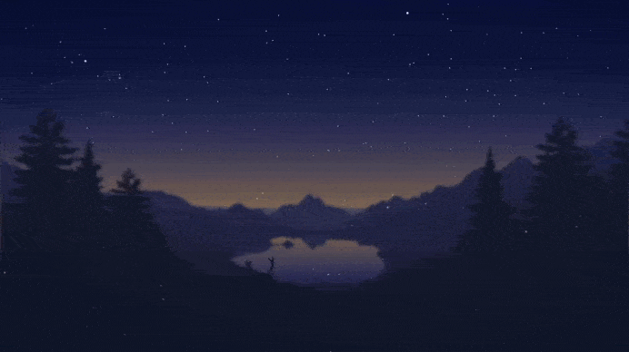
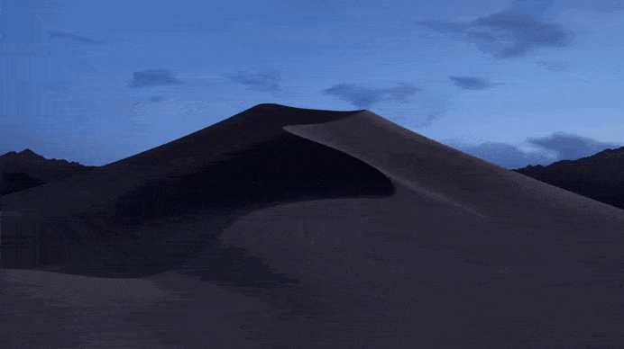
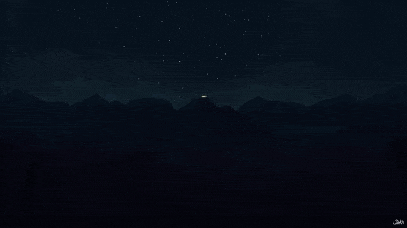
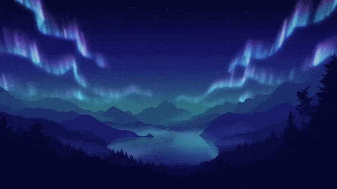
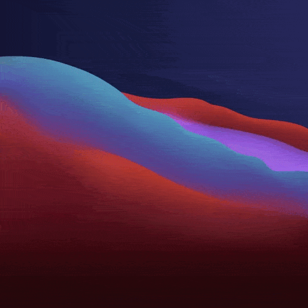
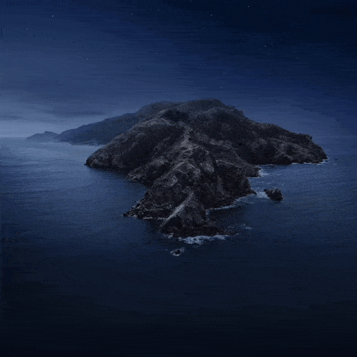

<h1 align="center">Dynamic Wallpapers for Windows</h1>
<h6 align="center">A collection of gorgeous time-based dynamic wallpapers for Windows, with a simple installer</h6>
<p align="center">

</p>

---

### Original Inspiration

[manishprivet/dynamic-gnome-wallpapers](https://github.com/manishprivet/dynamic-gnome-wallpapers) — ported from GNOME XML timed wallpapers to Windows via PowerShell and Task Scheduler.

## How It Works

Each wallpaper pack contains a set of images and an XML timeline that defines when to show each image and how to blend between them. A PowerShell script (`Set-TimedWallpaper.ps1`) reads the timeline, determines the current phase based on the time of day, and sets your desktop wallpaper — including smooth cross-fade transitions between images.

A scheduled task runs the script periodically so your wallpaper changes throughout the day automatically.

## Pre-requisites

- **Windows 10 / 11**
- **PowerShell 5.1+** (built into Windows)

## What's Included

```
├── Set-TimedWallpaper.ps1        # Core script — reads XML timeline and sets wallpaper
├── Install-TimedWallpaper.ps1    # Installer — pick a pack and create a scheduled task
├── wallpaper-packs/              # Wallpaper packs
│   ├── Lakeside/                 #   Each pack contains:
│   │   ├── *.jpg                 #     The wallpaper images
│   │   ├── Lakeside.xml          #     GNOME backgrounds XML
│   │   └── Lakeside-timed.xml    #     Timed transition XML
│   ├── Big_Sur/
│   └── ...
└── docs/                         # Preview GIFs
```

## Installation

1. **Open PowerShell as Administrator** in this folder.

2. Run the installer:

   ```powershell
   .\Install-TimedWallpaper.ps1
   ```

3. Pick a wallpaper pack from the menu:

   ```
   Available wallpaper packs:

     [1] A Certain Magical Index
     [2] Big Sur
     [3] Big Sur Beach
     [4] Catalina
     [5] Exodus
     [6] Firewatch
     [7] Fuji
     [8] Lakeside
     [9] Lakeside 2
     [10] Minimal Mojave
     [11] Mojave
     [12] MojaveV2

   Select a wallpaper pack (1-12):
   ```

4. Done! A scheduled task named **TimedWallpaper** is created and your wallpaper will start changing automatically.

### Switching Wallpaper Packs

Just run `.\Install-TimedWallpaper.ps1` again and choose a different pack. The old scheduled task is automatically replaced.

### Uninstallation

Remove the scheduled task from an admin PowerShell:

```powershell
Unregister-ScheduledTask -TaskName "TimedWallpaper" -Confirm:$false
```

---

## Wallpaper Gallery

### Lakeside



**Credits:** https://dribbble.com/shots/1816328-Lakeside-Sunrise

---

### A Certain Magical Index

> **Note:** This wallpaper pack is over **500 MB** due to the high-resolution source images.


**Credits:** https://dynamicwallpaper.club/u/legend

---

### Exodus


**Credits:** https://dynamicwallpaper.club/u/Juanra

---

### Minimal Mojave


**Credits:** https://dynamicwallpaper.club/u/octaviotti

---

### Mojave



**Credits:** https://www.reddit.com/r/apple/comments/8oz25c/all_16_full_resolution_macos_mojave_dynamic/

---

### Mojave V2


**Credits:** https://dynamicwallpaper.club/u/WeighingDog

---

### Big Sur Beach


**Credits:** https://dynamicwallpaper.club/u/DavidPicnic

---

### Firewatch



**Credits:** https://dynamicwallpaper.club/u/Jagoba

---

### Lakeside 2



**Credits:** https://dynamicwallpaper.club/u/vitaobr92

---

### Big Sur



**Credits:** https://dynamicwallpaper.club/u/jalbans17

---

### Fuji


**Credits:** https://dynamicwallpaper.club/u/MaxKulakov

---

### Catalina



**Credits:** https://dynamicwallpaper.club/u/wallpapyrus
